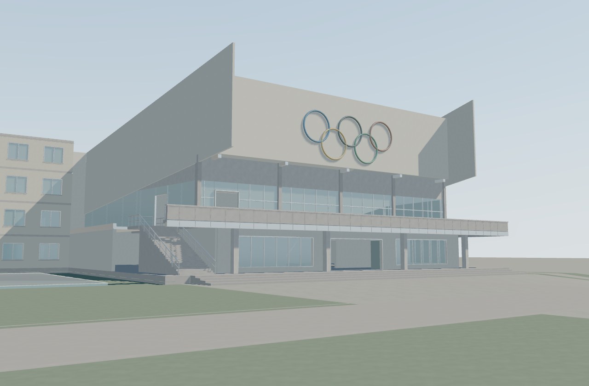
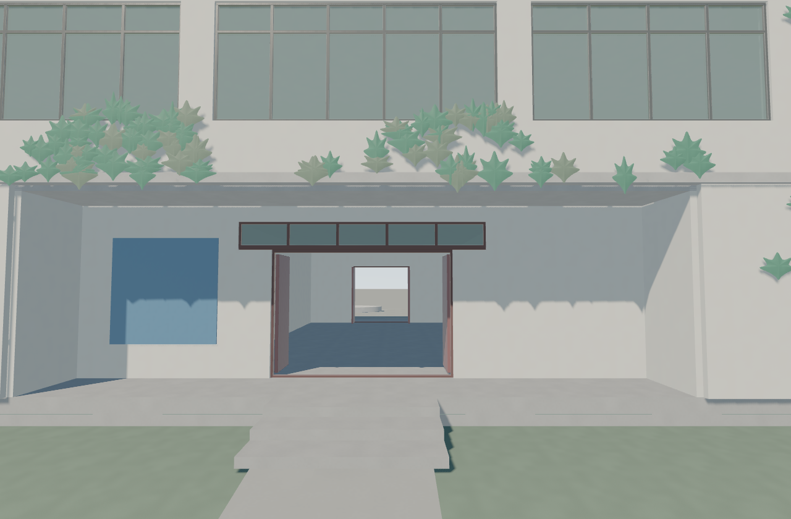

# 模型与材质精化 · 第二轮 · 2026-09-12

可见模型三角面由首轮的 **1,935,492 增至 3,297,824（+70.4%）**。本轮进一步加密曲面与构件倒角，建立 17 类独立表面，并在原有色板内调整暖墙、冷青玻璃、灰色构件和绿植的关系。

这是渲染精化的第二轮，独立于建筑批次 B03 的 R2 编号。B01/B02 的校友认可、B03 的待审状态及 A/P/H 证据边界继续保持。

## 模型精度

- 金属与门扇倒角分段由 2 提至 3，混凝土构件由 3 提至 4；倒角使用实际米制半径，保持在原构件包围范围内。
- 体育馆五环由 24 × 144 提至 32 × 192 分段，栏杆圆截面由 32 提至 48 分段；主楼穹顶由 64 × 32 提至 96 × 48，中央弧面采样由 192 提至 256。
- 图书馆爬藤由团块改为带浅弯曲、双面实体与叶片 UV 的薄叶网格，每片 840 个三角面；保留原覆盖范围。树冠继续沿用既有简化体量并加密曲面。
- 楼板、踏步顶面、真实开口和墙体分区保持精确接合。渲染、阴影、拾取与通行检测使用同一份实际几何。

## 材质与配色

颜色继续取自原有 Canvas Ramp LUT 的 22 组明暗色板，按材质在同一色系内调整。整体维持柔和、低饱和的校园风格；暖灰墙体、冷青玻璃、灰色混凝土和深浅绿植形成层次，种植土回到暖褐色。

| 表面 | 对应特征 |
|---|---|
| 粉刷墙、混凝土 | 分别使用细砂感柔和漫反射，以及较明显的矿物颗粒和浅孔隙 |
| 石质铺地、道路、石材、细砂 | 分别使用错缝灰缝与块面色差、连续细骨料、晶粒色差、暖砂颗粒 |
| 草地、叶片、土壤、树皮 | 分别使用草叶疏密、顺叶片展开的叶脉、土粒、纵向纤维与浅裂纹 |
| 金属、涂装金属、色漆 | 分别使用拉丝与集中反射、漆膜与金属高光、连续色面与柔和清漆光泽 |
| 玻璃、水面 | 冷青透明度与场景反射，以及细波纹扰动下的天空和建筑倒影 |
| 运动面层、织物 | 分别使用细橡胶颗粒、经纬纹理与柔和绒光 |

每类表面拥有不同结构的程序纹理，分别控制颜色、微起伏和粗糙度。构件用途优先于色板行号，例如同色的窗框与玻璃、楼板与金属、草叶与土壤分别匹配材质。修正了窗栅被误当作玻璃的问题。

校园内设置四处静态反射采样，玻璃、水面和金属可以反映周围建筑。继续使用程序天空、太阳光、AgX 色调映射和缓存阴影。未使用照片贴图、bloom、暗角或景深。

支持 `EXT_clip_control` 的设备使用反向深度缓冲，修正原先近景墙面、地砖及池沿的点状接缝；阴影偏移方向随深度模式切换。其他 WebGL2 设备保留对数深度回退。

表面微观结构、倒角、精确叶形与材质参数仍属于 **H 视觉补全**，不视为历史材料或叶形的照片考证。

## 交付

- [第二轮离线查看器](../artifacts/render-upgrade/Yali_Material_Detail_R2_Viewer.html)
- [最终浏览器报告](../qa/render-upgrade/r2/report.json)
- [首轮说明与对照](render-upgrade-2026-09-12.md)

查看器为 904,795 字节。SHA256：`59f5c408d109f91c80828f97f127d7d2ba68da35350c7d6df703a86c966b529b`。

体育馆：[首轮](../qa/render-upgrade/after/b02-photo-front.png) · [第二轮](../qa/render-upgrade/r2/b02-photo-front.png)



图书馆：[首轮](../qa/render-upgrade/after/b03-photo-library.png) · [第二轮](../qa/render-upgrade/r2/b03-photo-library.png)



后花园：[首轮](../qa/render-upgrade/after/b03-garden.png) · [第二轮](../qa/render-upgrade/r2/b03-garden.png)。另见 [主楼](../qa/render-upgrade/r2/r3-overview.png)、[食堂](../qa/render-upgrade/r2/b03-canteen.png)、[全景](../qa/render-upgrade/r2/overview.png)和[手机画面](../qa/render-upgrade/r2/mobile.png)。

## 验证与成本

TypeScript 与生产构建通过；9 项几何、材质语义、纹理结构及 BVH 定向测试通过。最终离线文件完成六个固定机位与 390 × 844 窄屏检查，控制台与 WebGL 错误为零。B02 五条、B03 十条路线及入口检查通过；三个旗位、主轴 x=73、主楼首层 y=3.45 和收起的卷帘通道保持。

额外检查了[反向深度下的顶视与主轴正交机位](../qa/render-upgrade/r2-orthographic/report.json)，以及[屏蔽扩展后的兼容回退](../qa/render-upgrade/r2-fallback/report.json)，均无 WebGL 或脚本错误。回退检查在同一设备上模拟，未冒充旧设备实测；对数深度回退下仍可见少量近景点状接缝。

| 实测指标 | 首轮 | 第二轮 |
|---|---:|---:|
| 可见模型三角面总数 | 1,935,492 | 3,297,824 |
| 几何缓冲区字节数 | 62,503,880 | 109,517,856 |
| 全景稳态绘制调用 | 1,478 | 1,481 |
| 全景帧间隔中位数／P95 | 16.7／33.4 ms | 16.8／33.4 ms |
| 花园帧间隔中位数／P95 | 33.2／33.5 ms | 16.7／33.5 ms |

采样环境为 Chrome 152、AMD Radeon Graphics、1280 × 840；每个机位预热后记录 60 帧。第二轮六机位中位帧间隔为 16.7–16.8 ms，P95 为 16.8–33.5 ms；数据包含浏览器调度影响，不代表其他设备或长时间运行的帧率保证。

几何缓冲区约 104.4 MiB，另有纹理、反射与 BVH 开销。反射为四处静态局部采样，不提供光线追踪、视差校正或多次光照反弹，也不会随建筑剖切实时重拍。生产构建仍提示单包超过 700 kB；离线版本将所需程序一并打包。

## 复现

```powershell
npm ci --prefix apps/campus
npm run build --prefix apps/campus
node --test --test-isolation=none tests/render-upgrade/*.test.mjs
node tools/render-upgrade/export.mjs
$env:VIEWER_URL = ([System.Uri]::new((Resolve-Path 'artifacts/render-upgrade/Yali_Material_Detail_R2_Viewer.html').Path)).AbsoluteUri
node tools/render-upgrade/capture.mjs r2
```

浏览器检查使用已安装的 Chrome 和 Playwright，可用 `PLAYWRIGHT_MODULE` 指定已有模块目录。`CAPTURE_VIEWS` 可指定逗号分隔机位，空值自动使用六个默认机位；报告会核对请求机位与实际机位一致。`CAPTURE_FORCE_LOG_DEPTH=1` 可模拟不支持反向深度扩展的设备，配合 `--visual-only` 检查回退画面。
