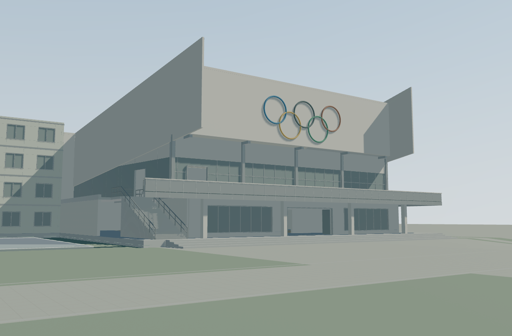

# 模型精度、材质与日光升级 · 2026-09-12

本页保留首轮的产物、截图与执行记录。当前工作树及默认导出已进入[第二轮精化](render-refinement-r2-2026-09-12.md)，最新复现命令以第二轮说明为准。

状态：本地实现与工程检查完成，效果待用户审阅。基于 `6e8238548cf9a2afd3d91c263b4ee9a47ed9f264` 的 B03 R2；B01/B02 的认可记录及 B03 的待审状态继续继承。

本轮按用户澄清，以增加有效几何细节和真实光照响应为目标。场景可见模型从 **550,912 增至 1,935,492 个三角面（3.51 倍）**。已撤回此前的地形、道路和围栏减面尝试。

## 实际变化

- 窗框、栏杆、柱、檐口、雨棚等构件增加按实际尺寸生成的倒角，金属边缘最大 8 mm，混凝土构件最大 35 mm，并受构件厚度约束。尺寸不同的构件分别建模，避免缩放把倒角拉长。
- 体育馆圆环由 8 × 48 提高到 24 × 144 段；杆件由 6／7 提高到 32 段。主楼圆顶由 28 × 14 提高到 64 × 32，圆柱由 24 提高到 64 段。
- 主楼中央浅弧、花园圆平台和池缘由 64 提高到 192 段。楼梯级数、入口位置和通行面继承现有模型；曲面采样增加不解释为新的历史测量证据。
- 固定三档着色替换为 Three.js 标准物理材质，保留原配色来源，区分粉刷、混凝土、铺地、金属、玻璃等表面。程序生成的微表面纹理按世界米制坐标铺设。
- 加入太阳光、程序天空环境反射、AgX 色调映射和最高 4096 阴影；近景集中阴影范围，静态阴影按需更新。环境光近似户外间接光，尚未实现光线追踪或多次反弹全局光照。
- 对数深度缓冲消除远景道路及跑道毫米级叠层的深度条纹。实际高精度三角面建立 BVH，用于拾取与通行检测。

倒角半径与材质参数属于 H 视觉补全，不提升历史事实的确定性。

## 交付与验证

- [高精度日光查看器](../artifacts/render-upgrade/Yali_High_Detail_Daylight_Viewer.html)：离线单文件，可直接用支持 WebGL2 的浏览器打开。
- [原版查看器](../artifacts/render-upgrade/Yali_Render_Before.html)：同一基准提交的对照导出。
- [最终浏览器报告](../qa/render-upgrade/after/report.json) · [原版报告](../qa/render-upgrade/before/report.json) · [建筑结构检查](../qa/render-upgrade/geometry-report.json)。

最终 Viewer SHA256：`53be6f22f153a38fe65050f585f5eeb17ec9fd5f81db5e33df2a02bfe40ad650`，891,288 字节。

TypeScript／生产构建通过；5 项新增几何及 BVH 测试通过；原有 10 项卷帘入口测试通过；B03 8 项结构检查通过。最终离线 HTML 在 Chrome 152、AMD Radeon Graphics、1280 × 840 下完成六个固定机位检查，控制台与 WebGL 错误为零。B02 五条、B03 十条路线及入口检查通过；三个旗位、主轴 x=73、主楼首层 y=3.45 保持。390 × 844 窄屏检查通过。

| 实测指标 | 原版 | 高精度版 |
|---|---:|---:|
| 可见模型三角面总数 | 550,912 | 1,935,492 |
| 几何缓冲区字节数 | 21,091,648 | 62,503,880 |
| 全景稳态绘制调用 | 2,821 | 1,478 |
| 全景帧间隔中位数／P95 | 50.0／66.5 ms | 16.7／33.4 ms |
| 花园帧间隔中位数／P95 | 33.3／33.7 ms | 33.2／33.5 ms |

帧间隔为每机位预热后的 60 帧采样，包含浏览器调度影响，不代表其他设备的帧率保证。合批与阴影缓存降低绘制开销，同时保留新增面数。高精度版几何内存约为原版的三倍，花园视角仍有约 33 ms 的帧间隔。浏览器检查针对几何通行，正式人物控制器仍属于 M1.1-C。

## 同机位画面

体育馆：[原版](../qa/render-upgrade/before/b02-photo-front.png) · [高精度版](../qa/render-upgrade/after/b02-photo-front.png)



主楼：[原版](../qa/render-upgrade/before/r3-overview.png) · [高精度版](../qa/render-upgrade/after/r3-overview.png)

后花园：[原版](../qa/render-upgrade/before/b03-garden.png) · [高精度版](../qa/render-upgrade/after/b03-garden.png)

## 复现

在仓库根目录执行：

```powershell
npm ci --prefix apps/campus
npm run build --prefix apps/campus
node --test --test-isolation=none tests/render-upgrade/*.test.mjs
node tools/render-upgrade/export.mjs
node tools/render-upgrade/export.mjs --baseline
$env:VIEWER_URL = ([System.Uri]::new((Resolve-Path 'artifacts/render-upgrade/Yali_High_Detail_Daylight_Viewer.html').Path)).AbsoluteUri
node tools/render-upgrade/capture.mjs after
```

浏览器检查需要已安装的 Chrome 和 Playwright；可用 `PLAYWRIGHT_MODULE` 指定现有 Playwright 模块目录，或用 `CHROMIUM_PATH` 指定浏览器。原版捕获时将 `VIEWER_URL` 指向 `Yali_Render_Before.html`，并使用 `capture.mjs before`。生成文件保存在 `artifacts/render-upgrade/`，同目录包含第三方许可。
